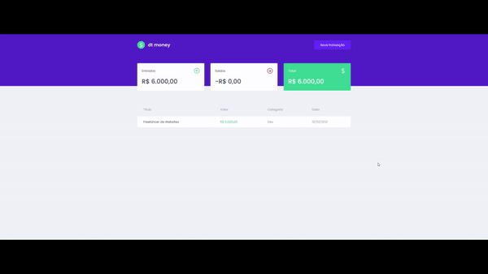

<h1 align="center">
  dt money
</h1>

<p align="center">
Essa aplicação oferece uma solução simples e eficaz para gerenciar suas finanças pessoais. Com ele, você pode facilmente cadastrar suas entradas e saídas financeiras, mantendo um controle detalhado das suas despesas e receitas.
</p>

<p align="center">
  <a href="#como-executar">ℹ️ Como Executar?</a>&nbsp;&nbsp;&nbsp;|&nbsp;&nbsp;&nbsp;
  <a href="#web">💻 Web</a>&nbsp;&nbsp;&nbsp;|&nbsp;&nbsp;&nbsp;
  <a href="#tecnologias">🚀 Tecnologias</a>&nbsp;&nbsp;&nbsp;
</p>

---

# Como Executar?

> Clone o Repositório:

Node version 14.20.0

Clone

```bash
git clone https://github.com/JonatanPaes/dtmoney.git
```

Para executar o projeto

```bash
cd dtmoney
```

Instale as dependências do projeto

```bash
yarn install
```

# Web
Para executar o projeto

```sh
yarn start
```

<p align="center">
  
</p>

# Tecnologias
- [ReactJS](https://react.dev/)
- [Axios](https://axios-http.com/)
- [TypeScript](https://github.com/microsoft/TypeScript)
- [Polished](https://polished.js.org/)
- [Styled Components](https://styled-components.com/)
- [MirageJS](https://miragejs.com/)
